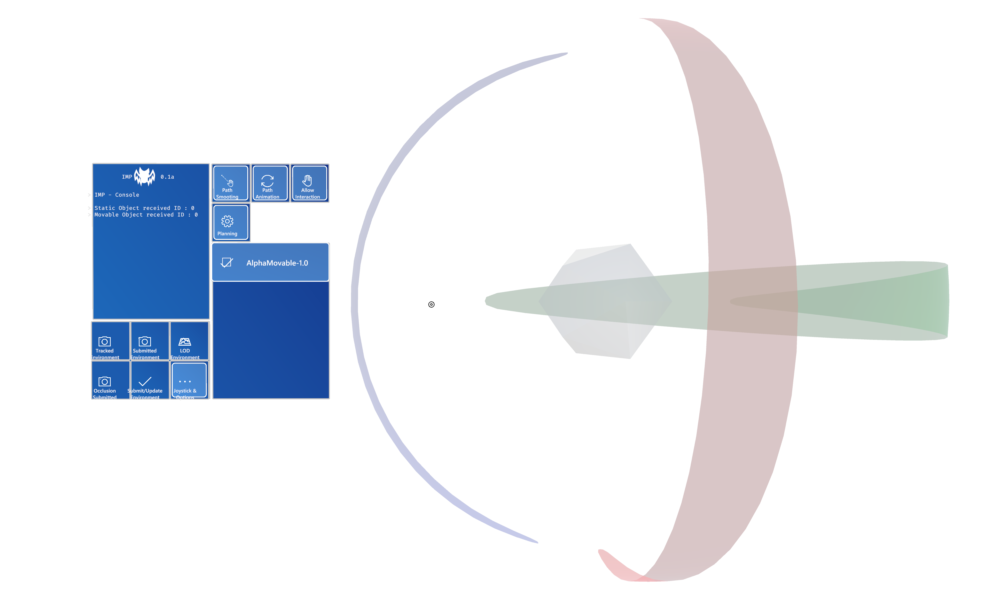

# IMP-Client 

The client application for the **I**nteractive **M**otion **P**lanner I developed as part of my master thesis. Works as companion to the [server application](https://github.com/catheart97/imp-server).

Build instructions can be found [here](https://github.com/catheart97/imp-client/wiki)

## Images

